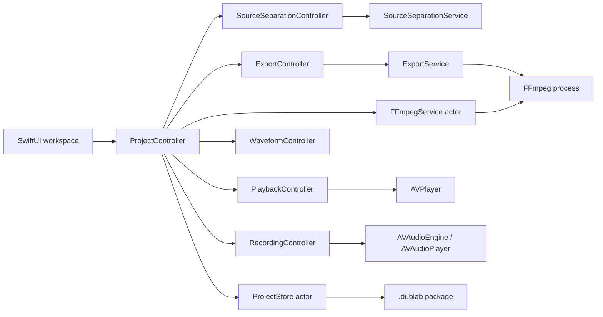
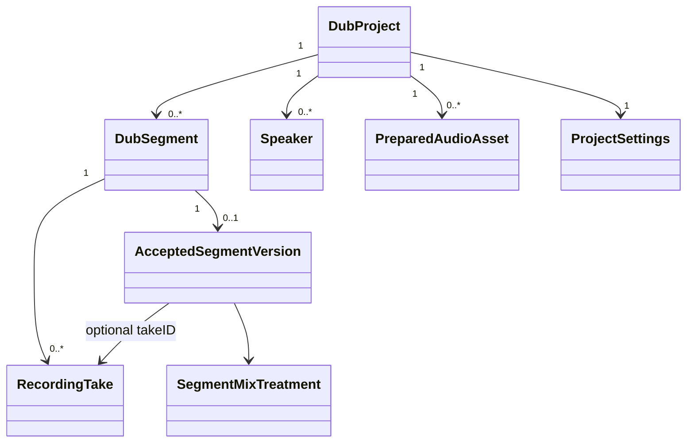

# DubLab architecture

This document describes the current implementation, its boundaries, and the constraints that should guide future changes.

## Design goals

DubLab is designed around five technical priorities:

1. Keep user media local and avoid backend infrastructure.
2. Remain responsive with feature-length source files.
3. Preserve source media rather than destructively modifying it.
4. Keep media engines replaceable behind typed Swift interfaces.
5. Prefer a simple working boundary over a generalized framework.

The app targets macOS 14 and Swift 6. SwiftUI owns the application structure; AVFoundation handles native playback and recording; FFmpeg is isolated behind `FFmpegService` for formats and render operations where Apple frameworks are insufficient.

## System overview



`ProjectController` is currently the orchestration boundary. It coordinates focused services but does not contain subtitle parsing, process execution, recording internals, or serialization implementations.

## Source tree

```text
openvoicer/
├── App/                 Project orchestration and new-project draft
├── Models/              Codable domain models and media metadata
├── Views/               SwiftUI workspace, sidebars, inspectors, recorder
├── Media/               Playback, recording, devices, waveforms, FFmpeg
├── Subtitles/           SRT and WebVTT parsing
├── Persistence/         Project packages, bookmarks, recent projects
├── SourceSeparation/    Protocol, controller, Bandit development adapter
├── Export/              Export state, render models, FFmpeg graph generation
└── Utilities/           Formatting and platform helpers
```

The Swift package exposes logic-heavy model, subtitle, and export targets so those components can be tested without launching the application.

## Domain model

`DubProject` is the aggregate persisted in `project.json`. Important relationships are:



Segments store source-movie timestamps, not proxy-relative timestamps. This is fundamental: exports, subtitles, prepared stems, and recordings all share the original movie timeline.

## Source media and playback proxies

The original source is represented by `SourceVideoReference`, which contains metadata, a last-known path for diagnostics, and a security-scoped bookmark.

AVFoundation cannot reliably open Matroska containers. For MKV sources, DubLab asks FFmpeg to create a MOV playback asset:

- Full-movie project: stream-copy the complete playable movie into `temp/source-playback.mov`.
- Clip project: seek through the Matroska index and copy only the selected range.
- Native MP4/MOV source: play the selected original directly without copying it.

`PlaybackController` exposes source-timeline values while translating seeks and periodic player time to a proxy-local timeline. UI and segments therefore continue to use absolute source timestamps even when the AVPlayer item begins at local time zero.

When the proxy-generation contract changes, increment `playbackPreparationVersion`. Reopening a project then regenerates stale cache files rather than trusting incompatible media.

## Subtitle flow

```text
External SRT/WebVTT ─┐
                     ├─> SubtitleParser ─> SubtitleCue ─> DubSegment
Embedded text track ─┘        ^
       │                       │
       └─ FFmpeg extraction ───┘
```

Parsing is deliberately independent of views and persistence. Embedded image subtitles are not OCR'd in the current implementation.

For clip projects, cues are filtered against `ProjectMediaScope` but retain source-movie timestamps.

## Recording flow

1. The selected segment is sought to its source start time.
2. `RecordingController` performs permission/device setup and countdown.
3. Microphone capture begins before picture playback.
4. `PlaybackController` plays the bounded segment, muted by default.
5. PCM WAV is written immediately under `recordings/<segment>/<take>.wav`.
6. Project metadata adds the `RecordingTake` and autosaves.

Recordings are never automatically deleted merely because another take is selected. Deletion is treated as an explicit operation.

## Continuous prepared audio

Dialogue preparation operates on the selected project range plus small edge handles. It creates a continuous dialogue/background pair, not independent line chunks:

```text
Selected source audio
        │
        ├─ detected M&E track ─> background
        │
        └─ Bandit separation ──> dialogue + background
```

Continuous stems avoid the audible ambience discontinuities created by stitching independently separated line fragments. `PreparedAudioAsset.timelineStart` maps stem-local time back to the source timeline.

The service protocol keeps the app open to a future native Core ML/MLX implementation without changing project or UI semantics.

## Preview mixing

Preview is intentionally non-destructive. Depending on the accepted treatment, the player and recording engine coordinate:

- original AVPlayer audio;
- reduced AVPlayer audio plus the take;
- prepared continuous background plus the take;
- or take playback alone.

Transitions use short gain ramps to reduce clicks and hard ambience changes. Accepted versions store a take ID and treatment separately so choosing a take does not silently dictate how it must be mixed.

## Export

Export always reads the security-scoped original source, never a playback proxy. `ExportService` builds one typed `ExportJob`, then generates the FFmpeg filter graph for its scope and accepted lines.

The video stream is copied where the output container permits it. Audio is rendered from the selected source track, continuous prepared stems when available, and accepted takes. A successful output file is standalone and has no dependency on the project package.

## Concurrency

- UI controllers are `@MainActor` observable types.
- Persistence and FFmpeg services are actors.
- Long-running process and media operations run asynchronously.
- Recording, export, proxy creation, and separation have explicit cancellation boundaries where supported.
- Closures crossing isolation boundaries are marked `@Sendable` where appropriate.

Do not move all services into a dependency-injection container. Initializer injection or direct ownership is sufficient until a concrete testing or lifecycle problem requires more.

## Persistence and migration

`ProjectStore` writes JSON atomically. Every project has a `schemaVersion`; optional/default decoding keeps older projects openable. New persisted fields must include a migration default and a round-trip or legacy-decoding test.

Generated assets should be replaceable caches whenever possible. User recordings and accepted decisions are durable project data and must not be treated as disposable cache entries.

## Logging and errors

Use `Logger` categories for project, video, audio, recording, subtitles, export, and FFmpeg behavior. User-facing errors should explain the failed action; detailed process output belongs in project logs such as `temp/ffmpeg-remux.log` or `temp/export.log`.

Do not use `print()` for production diagnostics and do not expose full user paths in telemetry. DubLab currently has no telemetry.

## Extension points

The intended future seams are:

- `TranscriptionService` for local Whisper implementations
- `SourceSeparationService` for native or alternative dialogue models
- typed export/mixing implementations beyond FFmpeg
- segment preprocessing strategies after subtitle parsing
- waveform cache/render improvements independent of recording

Any new engine should preserve the domain model's source-timeline convention and avoid embedding tool-specific command strings in views.
